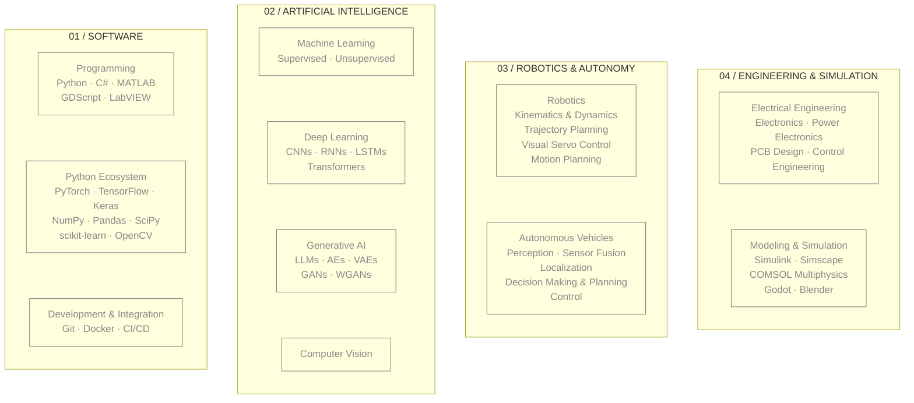

<table>
  <tr>
    <td width="34.25%">
      
    </td>
    <td width="65.75%">
      
    </td>
  </tr>
</table>

```mermaid
flowchart LR
    subgraph S["01 / SOFTWARE"]
      direction TB
      S1["Programming<br/>Python · C# · MATLAB<br/>GDScript · LabVIEW"]
      S2["Python Ecosystem<br/>PyTorch · TensorFlow · Keras<br/>NumPy · Pandas · SciPy<br/>scikit-learn · OpenCV"]
      S3["Development & Integration<br/>Git · Docker · CI/CD"]
      S1 ~~~ S2 ~~~ S3
    end

    subgraph A["02 / ARTIFICIAL INTELLIGENCE"]
      direction TB
      A1["Machine Learning<br/>Supervised · Unsupervised"]
      A2["Deep Learning<br/>CNNs · RNNs · LSTMs<br/>Transformers"]
      A3["Generative AI<br/>LLMs · AEs · VAEs<br/>GANs · WGANs"]
      A4["Computer Vision"]
      A1 ~~~ A2 ~~~ A3 ~~~ A4
    end

    subgraph R["03 / ROBOTICS & AUTONOMY"]
      direction TB
      R1["Robotics<br/>Kinematics & Dynamics<br/>Trajectory Planning<br/>Visual Servo Control<br/>Motion Planning"]
      R2["Autonomous Vehicles<br/>Perception · Sensor Fusion<br/>Localization<br/>Decision Making & Planning<br/>Control"]
      R1 ~~~ R2
    end

    subgraph E["04 / ENGINEERING & SIMULATION"]
      direction TB
      E1["Electrical Engineering<br/>Electronics · Power Electronics<br/>PCB Design · Control Engineering"]
      E2["Modeling & Simulation<br/>Simulink · Simscape<br/>COMSOL Multiphysics<br/>Godot · Blender"]
      E1 ~~~ E2
    end

    S ~~~ A ~~~ R ~~~ E

    classDef skill fill:transparent,stroke:#808080,color:#888888,stroke-width:1px
    class S1,S2,S3,A1,A2,A3,A4,R1,R2,E1,E2 skill

    style S padding:30px
    style A padding:30px
    style R padding:30px
    style E padding:30px
```
