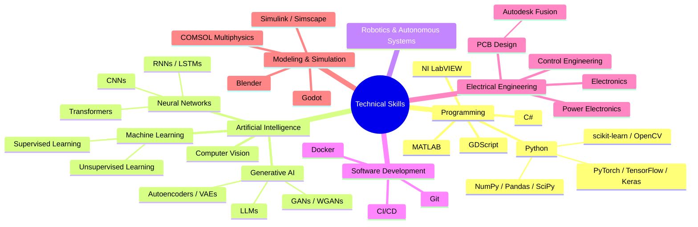

## Technical Skills

```mermaid
mindmap
  root((Technical Skills))
    Programming
      Python
        PyTorch / TensorFlow / Keras
        NumPy / Pandas / SciPy
        scikit-learn / OpenCV
      C#
      MATLAB
      GDScript
      NI LabVIEW

    Artificial Intelligence
      Machine Learning
        Supervised Learning
        Unsupervised Learning
      Neural Networks
        CNNs
        RNNs / LSTMs
        Transformers
      Computer Vision
      Generative AI
        LLMs
        Autoencoders / VAEs
        GANs / WGANs

    Robotics & Autonomous Systems

    Software Development
      Git
      Docker
      CI/CD

    Electrical Engineering
      Electronics
      Power Electronics
      PCB Design
        Autodesk Fusion
      Control Engineering

    Modeling & Simulation
      Simulink / Simscape
      COMSOL Multiphysics
      Godot
      Blender
```
