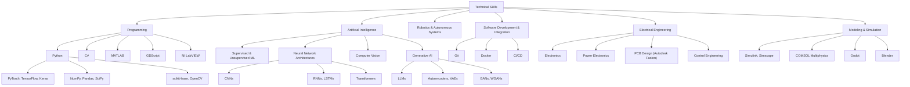

```mermaid
flowchart TD
    A["Technical Skills"]

    A --> B["Programming"]
    A --> C["Artificial Intelligence"]
    A --> D["Robotics & Autonomous Systems"]
    A --> E["Software Development & Integration"]
    A --> F["Electrical Engineering"]
    A --> G["Modeling & Simulation"]

    B --> B1["Python"]
    B1 --> B2["PyTorch, TensorFlow, Keras"]
    B1 --> B3["NumPy, Pandas, SciPy"]
    B1 --> B4["scikit-learn, OpenCV"]
    B --> B5["C#"]
    B --> B6["MATLAB"]
    B --> B7["GDScript"]
    B --> B8["NI LabVIEW"]

    C --> C1["Supervised & Unsupervised ML"]
    C --> C2["Neural Network Architectures"]
    C --> C3["Computer Vision"]
    C --> C4["Generative AI"]

    C2 --> C21["CNNs"]
    C2 --> C22["RNNs, LSTMs"]
    C2 --> C23["Transformers"]

    C4 --> C41["LLMs"]
    C4 --> C42["Autoencoders, VAEs"]
    C4 --> C43["GANs, WGANs"]

    E --> E1["Git"]
    E --> E2["Docker"]
    E --> E3["CI/CD"]

    F --> F1["Electronics"]
    F --> F2["Power Electronics"]
    F --> F3["PCB Design (Autodesk Fusion)"]
    F --> F4["Control Engineering"]

    G --> G1["Simulink, Simscape"]
    G --> G2["COMSOL Multiphysics"]
    G --> G3["Godot"]
    G --> G4["Blender"]
```
