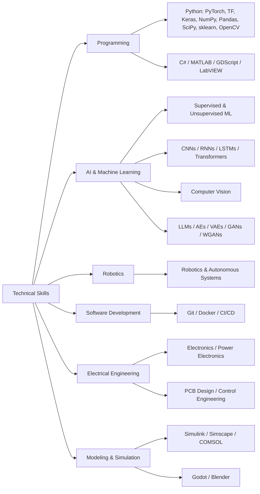

```mermaid
flowchart LR
    ROOT["Technical Skills"]

    ROOT --> P["Programming"]
    ROOT --> A["AI & Machine Learning"]
    ROOT --> R["Robotics"]
    ROOT --> S["Software Development"]
    ROOT --> E["Electrical Engineering"]
    ROOT --> M["Modeling & Simulation"]

    P --> P1["Python: PyTorch, TF, Keras, NumPy, Pandas, SciPy, sklearn, OpenCV"]
    P --> P2["C# / MATLAB / GDScript / LabVIEW"]

    A --> A1["Supervised & Unsupervised ML"]
    A --> A2["CNNs / RNNs / LSTMs / Transformers"]
    A --> A3["Computer Vision"]
    A --> A4["LLMs / AEs / VAEs / GANs / WGANs"]

    R --> R1["Robotics & Autonomous Systems"]

    S --> S1["Git / Docker / CI/CD"]

    E --> E1["Electronics / Power Electronics"]
    E --> E2["PCB Design / Control Engineering"]

    M --> M1["Simulink / Simscape / COMSOL"]
    M --> M2["Godot / Blender"]
```
