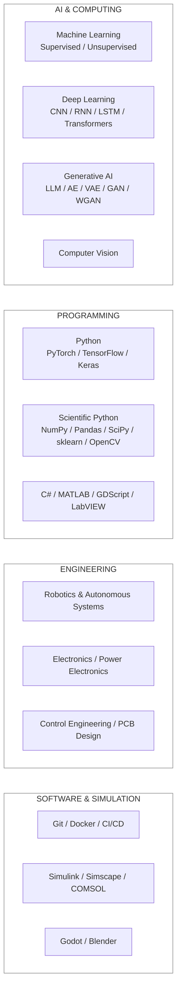

```mermaid
flowchart TB

    subgraph CORE["AI & COMPUTING"]
        direction LR
        A["Machine Learning<br/>Supervised / Unsupervised"]
        B["Deep Learning<br/>CNN / RNN / LSTM / Transformers"]
        C["Generative AI<br/>LLM / AE / VAE / GAN / WGAN"]
        D["Computer Vision"]
    end

    subgraph PROGRAMMING["PROGRAMMING"]
        direction LR
        E["Python<br/>PyTorch / TensorFlow / Keras"]
        F["Scientific Python<br/>NumPy / Pandas / SciPy / sklearn / OpenCV"]
        G["C# / MATLAB / GDScript / LabVIEW"]
    end

    subgraph ENGINEERING["ENGINEERING"]
        direction LR
        H["Robotics & Autonomous Systems"]
        I["Electronics / Power Electronics"]
        J["Control Engineering / PCB Design"]
    end

    subgraph TOOLS["SOFTWARE & SIMULATION"]
        direction LR
        K["Git / Docker / CI/CD"]
        L["Simulink / Simscape / COMSOL"]
        M["Godot / Blender"]
    end

    CORE ~~~ PROGRAMMING
    PROGRAMMING ~~~ ENGINEERING
    ENGINEERING ~~~ TOOLS

    style CORE fill:none,stroke:#888
    style PROGRAMMING fill:none,stroke:#888
    style ENGINEERING fill:none,stroke:#888
    style TOOLS fill:none,stroke:#888
```
