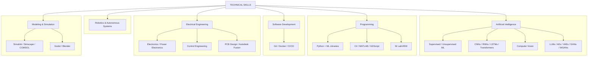

```mermaid
flowchart TB
    ROOT["TECHNICAL SKILLS"]

    ROOT --> AI
    ROOT --> PROG
    ROOT --> ROB
    ROOT --> DEV
    ROOT --> EE
    ROOT --> SIM

    subgraph A[" "]
        direction TB
        AI["Artificial Intelligence"]
        AI --> ML["Supervised / Unsupervised ML"]
        AI --> NN["CNNs / RNNs / LSTMs / Transformers"]
        AI --> CV["Computer Vision"]
        AI --> GEN["LLMs / AEs / VAEs / GANs / WGANs"]
    end

    subgraph B[" "]
        direction TB
        PROG["Programming"]
        PROG --> PY["Python + ML Libraries"]
        PROG --> LANG["C# / MATLAB / GDScript"]
        PROG --> LAB["NI LabVIEW"]
    end

    subgraph C[" "]
        direction TB
        ROB["Robotics & Autonomous Systems"]
    end

    subgraph D[" "]
        direction TB
        DEV["Software Development"]
        DEV --> TOOLS["Git / Docker / CI/CD"]
    end

    subgraph E[" "]
        direction TB
        EE["Electrical Engineering"]
        EE --> ELEC["Electronics / Power Electronics"]
        EE --> CTRL["Control Engineering"]
        EE --> PCB["PCB Design / Autodesk Fusion"]
    end

    subgraph F[" "]
        direction TB
        SIM["Modeling & Simulation"]
        SIM --> ENG["Simulink / Simscape / COMSOL"]
        SIM --> VIS["Godot / Blender"]
    end
```
